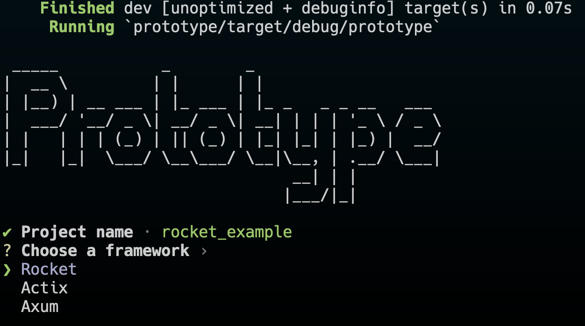

 _____           _        _
|  __ \         | |      | |
| |__) | __ ___ | |_ ___ | |_ _   _ _ __   ___
|  ___/ '__/ _ \| __/ _ \| __| | | | '_ \ / _ \
| |   | | | (_) | || (_) | |_| |_| | |_) |  __/
|_|   |_|  \___/ \__\___/ \__|\__, | .__/ \___|
                               __| | |
                              |___/|_|

### Prototype a simple rust cli/tui to get you started with popular rust frameworks.

Prototype is a CLI tool that allows users to spin up a rust project and project structure seamlessly. 

### Why Would I use this?

- Easy to install.
- Have the structure established for you.
- Setting up a Rust HTTP server.
- Integrate with a popular frameworks.
- Focus on the code.

### Frameworks Supported

- [Rocket](https://github.com/SergioBenitez/Rocket)

### License

Licensed under [MIT License](./LICENSE)
